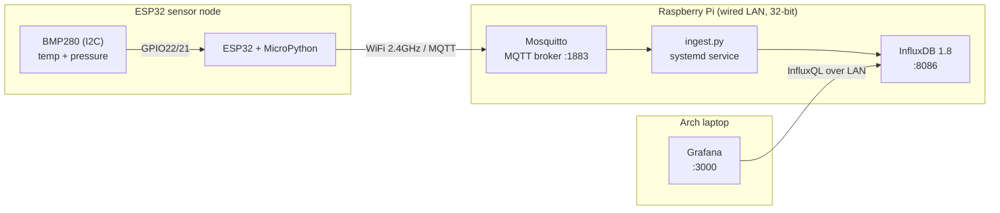

# Home Environmental Monitoring System

An ESP32 sensor node publishing temperature and pressure over MQTT to a Raspberry Pi,
with time-series persistence and a Grafana dashboard. Built end-to-end on real hardware:
edge firmware, a message broker, a data-ingest service, a time-series database, and
visualisation — the same shape as an industrial telemetry pipeline, at home scale.

This is the **as-built** record. The system that got built differs in several deliberate
ways from the original 64-bit/Docker plan, each forced by a real constraint and documented
below.

---

## 1. Architecture (as built)



Data path: **BMP280 → ESP32 (MicroPython) → MQTT → Mosquitto → ingest.py → InfluxDB → Grafana.**

The broker is the single integration point — anything that wants the data subscribes to it,
so storage, dashboards and future nodes are all decoupled from the firmware. Grafana lives on
a separate machine and reaches the database across the LAN, which turned out to be necessary
(see §6) and is arguably the better architecture anyway: the database stays light on the Pi,
and the heaviest component runs where there's headroom.

---

## 2. Hardware

| Part | Role | Notes |
|---|---|---|
| Raspberry Pi (32-bit Raspberry Pi OS, Trixie) | Broker + database host | 4 GB SD card — the constraint that shaped the software stack |
| ESP32 dev board (WROOM-32, CH340C USB-UART) | Sensor node | Classic ESP32 — **2.4 GHz only**, no 5 GHz |
| BMP280 (HW-611 purple breakout) | Temp + pressure | Bought as BMP280; chip ID `0x58` confirmed BMP, **no humidity** |
| Gigabit switch + powerline adapter | Pi's wired uplink | Pi on `eth0` via the powerline-fed LAN segment |

### Wiring (I²C)

| BMP280 pad | ESP32 pin |
|---|---|
| VCC | 3V3 (**not** 5V/VIN) |
| GND | GND |
| SCL | GPIO22 |
| SDA | GPIO21 |
| CSB, SDO | left unconnected |

The HW-611 ships as *either* a BMP280 or a BME280 and listings are unreliable, so the build
reads the chip-ID register (`0xD0`) to confirm which: `0x58` = BMP280 (temp + pressure),
`0x60` = BME280 (adds humidity). This one is a BMP280.

---

## 3. Software stack

All three Pi services are installed **natively from apt** rather than via Docker — on 32-bit
ARM this avoids depending on multi-arch container images and is lighter on a constrained Pi.

### Broker — Mosquitto

`/etc/mosquitto/conf.d/local.conf`:

```conf
listener 1883
allow_anonymous true
```

Anonymous on a trusted LAN keeps v1 simple; locking it down is the first hardening step (§8).

### Database — InfluxDB 1.8

**1.8, not 2.x** — InfluxDB 2.x has no 32-bit ARM build, so the modern stack simply won't run
here. 1.8 is the last of the 1.x line, fully supported on `armhf`, and uses InfluxQL with a
plain database model (no org/bucket/token), which is actually simpler for a v1.

Installed from the direct `.deb` rather than the apt repo (see §6 — the repo's signature
verification fails on Trixie):

```bash
wget https://dl.influxdata.com/influxdb/releases/influxdb_1.8.10_armhf.deb
sudo dpkg -i influxdb_1.8.10_armhf.deb
sudo systemctl enable --now influxdb
influx -execute 'CREATE DATABASE env'
```

### Ingest — `ingest.py` as a systemd service

A small Python subscriber bridges MQTT → InfluxDB. Chosen over Telegraf so the data pipeline
is explicit and legible. It uses the 1.x client (`influxdb`, not `influxdb-client`), and any
numeric field in the JSON payload is written automatically — so adding a sensor never requires
touching the ingest layer. Full source in `ingest/ingest.py`.

Run as a managed service so it starts on boot and restarts on failure —
`/etc/systemd/system/env-ingest.service`:

```ini
[Unit]
Description=Environmental monitoring MQTT to InfluxDB ingest
After=network-online.target mosquitto.service influxdb.service
Wants=network-online.target

[Service]
Type=simple
User=User
WorkingDirectory=/home/User/environmental-monitoring/ingest
ExecStart=/home/User/environmental-monitoring/ingest/.venv/bin/python /home/User/environmental-monitoring/ingest/ingest.py
Restart=always
RestartSec=5

[Install]
WantedBy=multi-user.target
```

Runs as a normal user (no privileged ports needed), calls the venv's Python directly, and
`Restart=always` means if it starts before the broker is ready it simply retries until it
connects. Logs go to the journal: `journalctl -u env-ingest.service -f`.

> Note: under systemd, Python stdout is block-buffered, so `print()` lines don't appear in the
> journal until `Environment=PYTHONUNBUFFERED=1` is set on the service. Data still flows
> regardless — this only affects log visibility.

### Visualisation — Grafana (on the laptop)

Grafana runs on the Arch laptop, not the Pi (§6), and queries the Pi's InfluxDB over the LAN.
InfluxDB 1.8 listens on all interfaces by default, so no Pi-side change was needed.

Datasource: type **InfluxDB**, query language **InfluxQL**, URL `http://<pi-ip>:8086`,
database `env`, no auth.

Panel queries:

```sql
SELECT mean("temperature") FROM "environment" WHERE $timeFilter GROUP BY time($__interval) fill(null)
SELECT mean("pressure")    FROM "environment" WHERE $timeFilter GROUP BY time($__interval) fill(null)
```

Set the pressure panel's unit to **hPa** and floor the Y-axis around 980 — pressure only moves
between ~980–1040 hPa, so auto-scaling from zero flattens the signal.

---

## 4. Firmware (ESP32 / MicroPython)

MicroPython chosen for the node: Python-native, real code rather than declarative config, and
a fast path to a working node. Files in `firmware/micropython/`:

- `main.py` — connects WiFi, **auto-detects the sensor's I²C address** (0x76/0x77), reads the
  BMP280, publishes JSON every 15 s, and retries the MQTT connection on publish failure.
- `bme280.py` — the robert-hh integer driver (drives the BMP280; humidity reads 0 and is
  dropped from the payload).
- `umqtt.simple` — installed on-device via `mpremote ... mip install umqtt.simple`.

Flash + load (from the laptop, classic ESP32 → flash offset `0x1000`):

```bash
esptool --port /dev/ttyUSB0 erase_flash
esptool --port /dev/ttyUSB0 --baud 460800 write_flash 0x1000 ESP32_GENERIC-*.bin
mpremote connect /dev/ttyUSB0 mip install umqtt.simple
mpremote connect /dev/ttyUSB0 cp bme280.py :
mpremote connect /dev/ttyUSB0 cp main.py :     # auto-runs on every power-up
```

Confirmed to cold-boot into publishing after a bare power cycle (no laptop attached).

---

## 5. MQTT topic schema

```
home/<location>/<node_id>/state      # JSON payload, all metrics for that node
```

Example payload:

```json
{ "temperature": 21.4, "pressure": 1012.8 }
```

The ingest service subscribes to `home/+/+/state` and tags each point with the `location` and
`node_id` parsed from the topic. One structured topic plus a JSON payload keeps the namespace
clean, makes wildcard subscriptions trivial, and means new metrics never create new topics.

---

## 6. Design decisions & constraints

Each of these was forced by something real, not chosen on preference:

- **InfluxDB 1.8, not 2.x** — 2.x is 64-bit only; the Pi is 32-bit. 1.8 is the supported
  `armhf` path and its simpler database/InfluxQL model is no loss for v1.
- **Native apt, not Docker** — more reliable than chasing arm/v7 container images on 32-bit,
  and lighter on the Pi.
- **Grafana offloaded to the laptop** — the 4 GB SD card couldn't fit a ~1 GB Grafana install
  alongside the OS and database. Moving it across the LAN solved the disk problem and keeps the
  heaviest component off the constrained host.
- **Python ingest, not Telegraf** — makes the pipeline explicit and is the portfolio-stronger
  choice; Telegraf remains a valid zero-code alternative.
- **JSON-payload-per-node** — adding a field requires no change to ingest or Grafana.
- **Static IP (recommended)** — the Pi's address moved twice during the build (WiFi→wired, and
  a lease change). A DHCP reservation on the wired MAC stops both SSH and the ESP32 nodes
  breaking on a lease renewal. *(Outstanding — see §8.)*

---

## 7. Problems encountered & how they were diagnosed

The build log. This section is the point of the writeup — it spans firmware, Linux,
networking, packaging and hardware.

- **SSH `.local` wouldn't resolve.** mDNS, not the Pi — resolved by SSHing to the IP from the
  router's DHCP lease table instead of the hostname.
- **64-bit plan abandoned mid-build** when the only available card was 32-bit. Triggered the
  InfluxDB 1.8 swap and the whole native-apt rework.
- **InfluxData apt repo failed signature verification on Trixie** (`sqv ... Missing key`).
  Cause: InfluxData rotated their package signing key on 6 Jan 2026, and Trixie's stricter
  `sqv` verifier rejected the old compat key. Fix: bypass the repo, install the 1.8.10 `.deb`
  directly — same first-party binary, no signature gate.
- **Grafana install ran out of disk** (`No space left on device`; ~1 GB needed, 717 MB free on
  the 4 GB card). Diagnosed with `df -h /` + `lsblk` — a genuinely small card, not an
  unexpanded filesystem. Resolved by offloading Grafana to the laptop.
- **`pacman -S grafana` 404'd on the laptop.** Stale package DB pointing at a deleted version —
  the classic Arch partial-upgrade trap. Fixed with a full `pacman -Syu`.
- **ESP32 serial port never appeared** (`/dev/ttyUSB*` empty) despite `lsusb` seeing the CH340.
  `modprobe ch341` → `Module not found in /lib/modules/7.0.3-arch1-2`: the earlier `-Syu` had
  installed a newer kernel, so the running kernel's modules no longer existed on disk. Fixed by
  rebooting into the matching kernel.
- **Serial permission denied** — Arch uses the `uucp` group for serial devices (not `dialout`),
  and the group membership only applies after a full re-login, not just `newgrp`.
- **A stuck `main.py` blocked the REPL** (Ctrl-C/Ctrl-D wouldn't break in). Reflashed with
  `esptool erase_flash` — which talks to the ROM bootloader below MicroPython, so a runaway
  script can't block it.
- **Sensor not detected** (`i2c.scan()` → `[]`). Traced to **reversed VCC/GND** on the
  cannibalised connector — the sensor had been powered backwards. Corrected the polarity; the
  BMP280 survived and scanned at `0x76`. 
- **BMP vs BME ambiguity** on the HW-611 — settled by reading chip-ID `0xD0`: `0x58` = BMP280,
  so temp + pressure only.
- **No ingest after `cp main.py`.** Copying a file mid-session doesn't restart the board; a
  soft reboot (Ctrl-D) ran the new `main.py`. Confirmed with a full power cycle that it
  cold-boots into publishing unattended.

---

## 8. Known limitations & next steps

- **Broker is anonymous, InfluxDB is unauthenticated** — fine on a trusted LAN; first hardening
  step is a Mosquitto password file (and optionally InfluxDB auth + TLS).
- **No static IP yet** — set a DHCP reservation on the Pi's wired MAC so the broker address
  stops moving.
- **Ingest drops readings if InfluxDB is briefly down** — it catches the write error and
  continues rather than buffering. A store-and-forward buffer would close that gap.
- **`PYTHONUNBUFFERED=1`** on the ingest service for live journal logs (data is unaffected
  either way).
- **Single node, two metrics** — the JSON-per-node design means adding a garden node
  (DS18B20 + capacitive soil moisture) or indoor CO₂ (SCD41) needs only firmware changes.
- **Battery + deep sleep** for an untethered outdoor node.

---

## 9. Repository structure

```
environmental-monitoring/
├── README.md                       # this file (as-built)
├── ingest/
│   ├── ingest.py                   # MQTT -> InfluxDB 1.8 bridge
│   └── requirements.txt            # paho-mqtt, influxdb
├── firmware/
│   └── micropython/
│       ├── main.py                 # node: WiFi + BMP280 + MQTT publish
│       └── bme280.py               # robert-hh integer driver
├── broker/
│   └── mosquitto.conf              # listener + anonymous
├── systemd/
│   └── env-ingest.service          # ingest as a managed service
└── dashboards/
    └── environment.json            # exported Grafana dashboard
```

---

**Status:** v1 complete and running — physical sensor through to live dashboard, surviving
reboots at both the node and the Pi. Built on real constraints, with the full diagnostic trail
recorded above.
